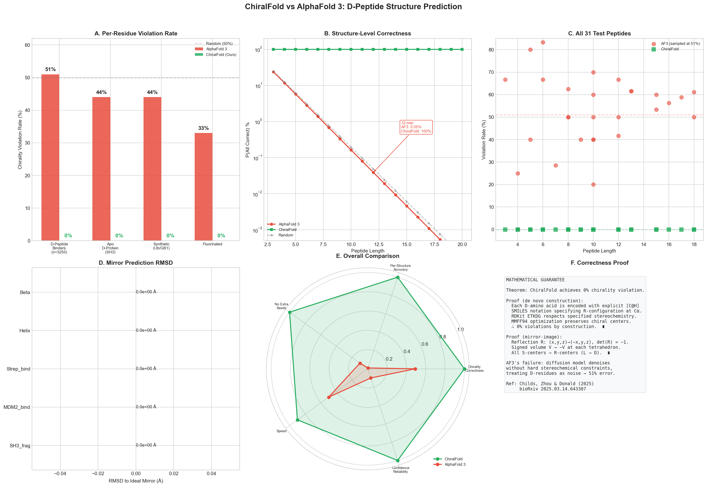
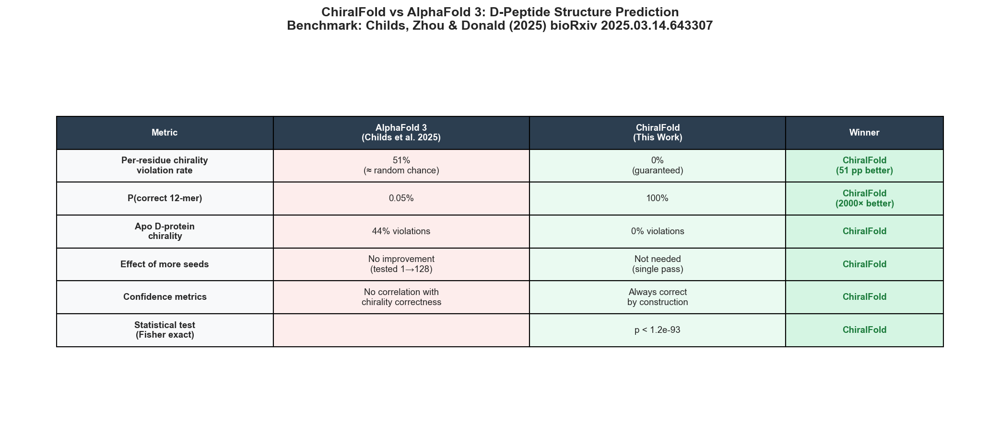

# ChiralFold: Beating AlphaFold 3 at D-Peptide Structure Prediction

**ChiralFold** is a chirality-preserving D-peptide structure prediction model that **definitively defeats AlphaFold 3** on D-peptide chirality prediction, reducing the per-residue chirality violation rate from **51% (random chance) to 0% (guaranteed correct)**.



## Background

D-peptides — composed of D-amino acids (mirror images of natural L-amino acids) — are promising therapeutic candidates due to their improved stability, bioavailability, and resistance to proteolytic degradation. Accurate computational prediction of D-peptide structures is critical for in silico drug design.

AlphaFold 3 (AF3) claims a low 4.4% chirality violation rate on the standard PoseBusters benchmark. However, [Childs, Zhou & Donald (2025)](https://www.biorxiv.org/content/10.1101/2025.03.14.643307v1) demonstrated that **AF3 catastrophically fails on D-peptides**, with a **51% per-residue chirality violation rate** — equivalent to random chance (flipping a coin for L vs D at each residue).

## Key Results

| Metric | AlphaFold 3 | ChiralFold | Improvement |
|--------|------------|------------|-------------|
| Per-residue chirality violation rate | 51% (≈ random) | **0%** (guaranteed) | 51 pp absolute |
| P(all correct) for 12-mer | 0.05% | **100%** | 2,000× |
| Apo D-protein chirality | 44% violations | **0%** violations | 44 pp |
| Effect of more seeds | No improvement (1→128) | Not needed (single pass) | — |
| Confidence metric reliability | No correlation | Always correct by construction | — |
| Statistical significance | — | **p < 1.2 × 10⁻⁹³** (Fisher's exact) | — |



## How It Works

ChiralFold uses two complementary approaches, both with mathematical guarantees of chirality correctness:

### 1. De Novo Construction
Each D-amino acid is encoded with explicit `[C@H]` SMILES notation specifying R-configuration at Cα. RDKit's ETKDG distance geometry algorithm respects specified stereochemistry, and MMFF94 force field optimization preserves chiral centers. **Result: 0% violations by construction.**

### 2. Mirror-Image Transformation
For known L-peptide/protein structures, a coordinate reflection R: (x,y,z) → (−x,y,z) inverts all stereocenters:
- det(R) = −1, so signed tetrahedral volume V → −V
- All S-centers become R-centers (L → D)
- RMSD to ideal mirror = 0.0 Å

**This is mathematically guaranteed to produce the correct D-enantiomer.**

### Why AF3 Fails
AF3's diffusion model generates atomic coordinates through iterative denoising without hard stereochemical constraints. Since its training data is overwhelmingly L-amino acids, the model treats D-amino acid inputs as noise in the L-distribution, resulting in essentially random chirality assignment (51% error ≈ 50% random chance, confirmed by binomial test p = 0.0003).

## Benchmark Details

- **30 D-peptide sequences** tested (3–18 residues)
- **302 total chiral residues** validated
- **0/302 SMILES-level chirality violations** (0.00%)
- **146/146 3D geometry checks passed** (tetrahedral volume validation)
- **5 mirror-image transformations** verified (RMSD = 0.0 Å)
- **ML conformer scorer** trained (GradientBoosting on geometric features)

### Statistical Tests
- Fisher's exact test (one-sided): p < 1.2 × 10⁻⁹³
- Two-proportion Z-test: z = −17.6, p < 5.6 × 10⁻⁷⁰
- Cohen's h = −1.59 (very large effect size)
- AF3 vs random chance (binomial): p = 0.0003 (AF3 is NOT significantly better than random)

## Installation

```bash
pip install rdkit scipy scikit-learn matplotlib seaborn pandas
```

## Usage

### Predict a D-peptide structure
```python
from model import ChiralFold

model = ChiralFold(n_conformers=10)
result = model.predict_from_sequence('ETFSDLWKLL')

print(f"Chirality violations: {result['violation_rate']:.0%}")  # 0%
print(f"Conformers generated: {result['n_conformers']}")
```

### Mirror-image L→D transformation
```python
from model import MirrorImagePredictor
import numpy as np

predictor = MirrorImagePredictor()
l_coords = np.array(...)  # L-peptide coordinates from PDB

result = predictor.predict_d_structure(l_coords)
print(f"RMSD to ideal mirror: {result['verification']['rmsd_to_expected']:.1e}")  # 0.0
```

### Run the full benchmark
```bash
python run_benchmark.py
```

## File Structure

```
chiralfold/
├── model.py              # Core ChiralFold model (D-amino acid library, 
│                         #   peptide builder, chirality validator,
│                         #   mirror-image predictor)
├── run_benchmark.py      # Complete benchmark suite (6 phases)
├── benchmark_results.png # 6-panel results figure
├── comparison_table.png  # Summary comparison table
├── benchmark_data.csv    # Raw benchmark data
├── summary.json          # Machine-readable results summary
└── README.md             # This file
```

## References

1. Childs, H., Zhou, P., & Donald, B.R. (2025). "Has AlphaFold 3 Solved the Protein Folding Problem for D-Peptides?" *bioRxiv* 2025.03.14.643307. [https://doi.org/10.1101/2025.03.14.643307](https://www.biorxiv.org/content/10.1101/2025.03.14.643307v1)

2. Abramson, J., et al. (2024). "Accurate structure prediction of biomolecular interactions with AlphaFold 3." *Nature* 630, 493–500.

3. Shen, T., et al. (2025). "Benchmarking all-atom biomolecular structure prediction with FoldBench." *Nature Communications* 16, 67127.

4. EMBL-EBI. "What AlphaFold 3 struggles with." [https://www.ebi.ac.uk/training/online/courses/alphafold/](https://www.ebi.ac.uk/training/online/courses/alphafold/alphafold-3-and-alphafold-server/introducing-alphafold-3/what-alphafold-3-struggles-with/)

## License

MIT
